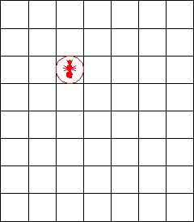

# AND Digital Coding Challenges

## All Challenges are saved as individual branches. Please see branch for challenge code.

- Challenge 1: "ControlC, Control V"
- Challenge 2: "Langton's Ant"

### Challenge 2
The task this week is to create a simulation of Langton's Ant. Langton's Ant is a cellular automaton that moves around a two-dimensional grid of black and white cells. The ant can face one of four different directions - north, south, east or west. At each step of the simulation the ant will decide where to move - if the ant is currently on a black cell then it turns 90 degrees to the right and moves forward one cell . Similarly, if the ant is on a white cell then it turns 90 degrees to the left and moves forward one cell. Whenever the ant leaves a cell, it inverts the colour of that cell. You're free to choose the starting size and colour of your grid, as well as the starting direction and position of the ant.

#### Rewards:
-  Points are awarded for a working simulation of Langton's Ant with a simple user interface to display the grid and the ant's movement.
-   Further points are awarded for creating your simulation in a unique choice of language (or a unique frontend JavaScript framework).
-   Further points are awarded for expanding the grid by one cell in all directions if the ant attempts to move outside of the grid.

#### Submission:
When you have a solution, submit a link to your source code repo (#coding-challenges) using the /submit command here on Slack. Please include any code and data required in order to test your solution easily. Submission closes noon on the 1st March.
Good luck! (edited)

